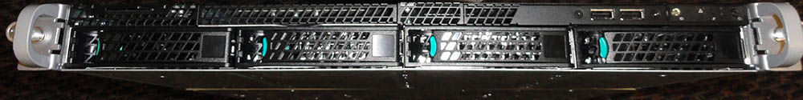
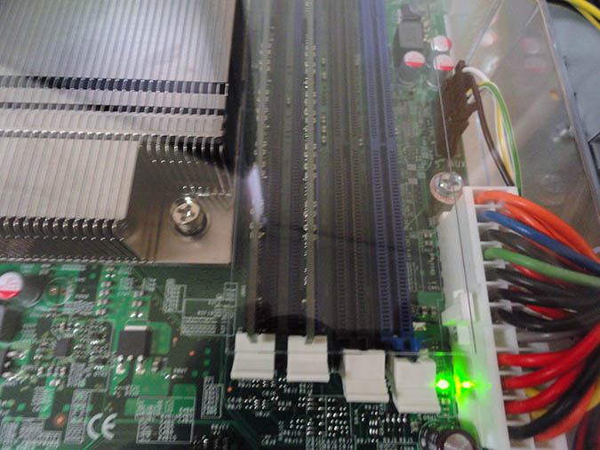
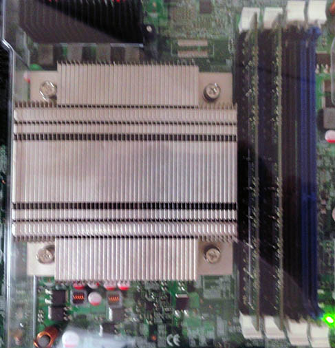
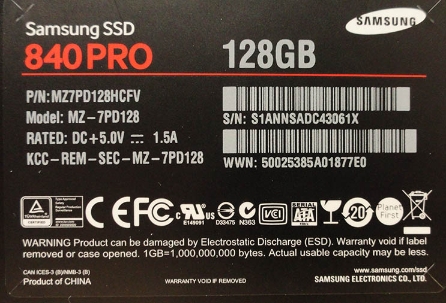
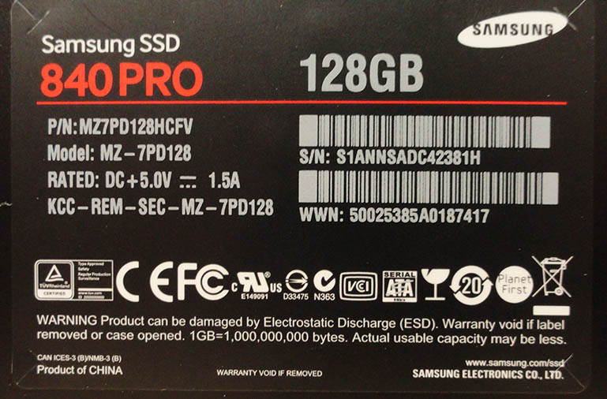
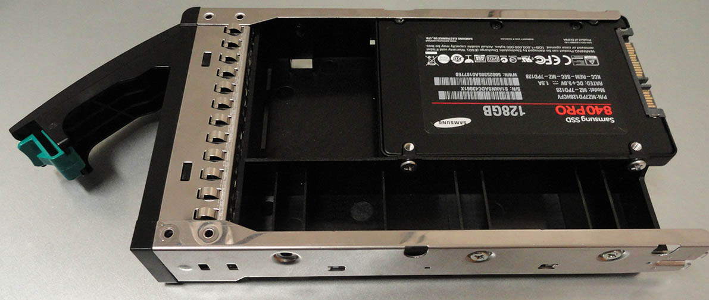
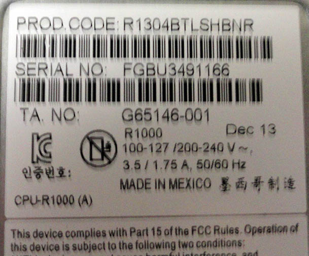
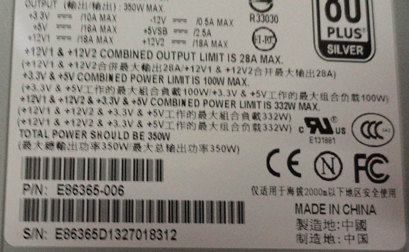
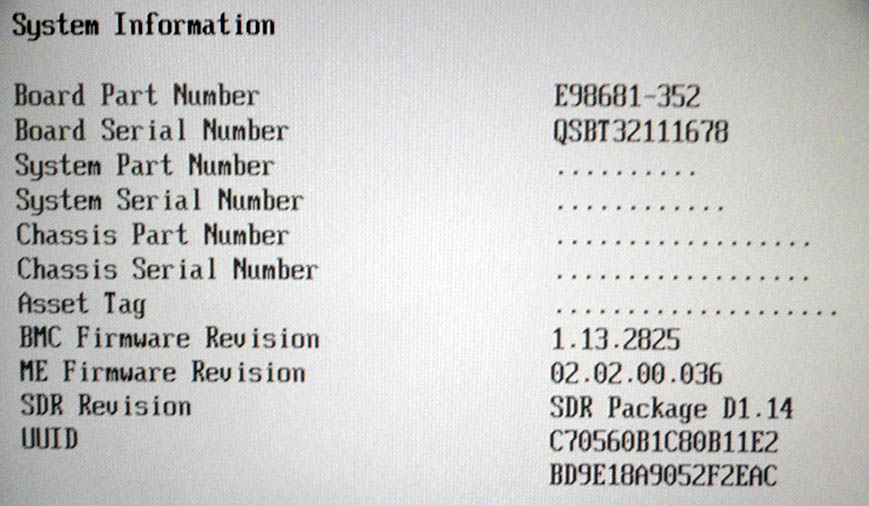
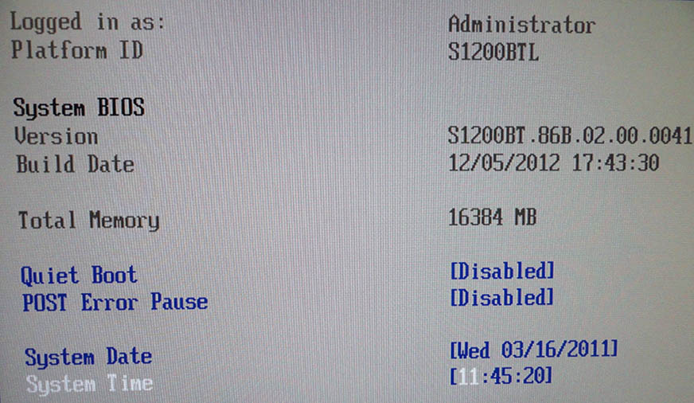

<link rel='stylesheet' href='markdown9.css'/>

Components
----------

- Intel R1304BTLSHBNR 1U Rack Server Barebone
- Intel Xeon E3-1230 V2 Ivy Bridge 3.3GHz (3.7GHz Turbo) 4 x 256KB L2 Cache 8MB L3 Cache LGA 1155 69W Quad-Core Server Processor BX80637E31230V2
- Kingston KVR13E9K2/16I 2x8GB ECC UDIMMs
- 2x SAMSUNG 840 Pro Series MZ-7PD128BW 2.5" 128GB SATA III MLC Internal Solid State Drive

Disks
-----

Slot 1: /dev/sda, 128 GB SSD

Slot 2: /dev/sdb, 128 GB SSD

Slot 3: spacer

Slot 4: backup drive (750 GB at the moment)

Partitions
----------

    Disk /dev/sda: 128.0 GB, 128035676160 bytes
    255 heads, 63 sectors/track, 15566 cylinders, total 250069680 sectors
    Units = sectors of 1 * 512 = 512 bytes
    Sector size (logical/physical): 512 bytes / 512 bytes
    I/O size (minimum/optimal): 512 bytes / 512 bytes
    Disk identifier: 0x000f111e
    
       Device Boot      Start         End      Blocks   Id  System
    /dev/sda1              63   215062154   107531046   fd  Linux raid autodetect
    /dev/sda2       215062216   248043599    16490692    5  Extended
    /dev/sda3   *   248045568   250068991     1011712   83  Linux
    /dev/sda5       215062218   248043599    16490691   82  Linux swap / Solaris

    Disk /dev/sdb: 128.0 GB, 128035676160 bytes
    255 heads, 63 sectors/track, 15566 cylinders, total 250069680 sectors
    Units = sectors of 1 * 512 = 512 bytes
    Sector size (logical/physical): 512 bytes / 512 bytes
    I/O size (minimum/optimal): 512 bytes / 512 bytes
    Disk identifier: 0x000f111e

       Device Boot      Start         End      Blocks   Id  System
    /dev/sdb1   *          63   215062154   107531046   fd  Linux raid autodetect

    /dev/sda1 and /dev/sdb1 form a software RAID 1 array. Motherboard fakeraid was not working well with GRUB2 

    /dev/md0:
            Version : 1.2
      Creation Time : Thu Mar 13 23:32:26 2014
         Raid Level : raid1
         Array Size : 107465408 (102.49 GiB 110.04 GB)
      Used Dev Size : 107465408 (102.49 GiB 110.04 GB)
       Raid Devices : 2
      Total Devices : 2
        Persistence : Superblock is persistent

        Update Time : Thu Mar 20 15:55:09 2014
              State : clean 
     Active Devices : 2
    Working Devices : 2
     Failed Devices : 0
      Spare Devices : 0

               Name : dds-web1:0  (local to host dds-web1)
               UUID : 1f606965:deff8eea:e7e84be3:71805e7a
             Events : 36
    
        Number   Major   Minor   RaidDevice State
           0       8        1        0      active sync   /dev/sda1
           1       8       17        1      active sync   /dev/sdb1

Thermal
-------

Idle temperatures:

    acpitz-virtual-0
    Adapter: Virtual device
    temp1:        +27.8??C  (crit = +100.0??C)
    temp2:        +29.8??C  (crit = +100.0??C)

    coretemp-isa-0000
    Adapter: ISA adapter
    Physical id 0:  +28.0??C  (high = +85.0??C, crit = +105.0??C)
    Core 0:         +27.0??C  (high = +85.0??C, crit = +105.0??C)
    Core 1:         +28.0??C  (high = +85.0??C, crit = +105.0??C)
    Core 2:         +25.0??C  (high = +85.0??C, crit = +105.0??C)
    Core 3:         +27.0??C  (high = +85.0??C, crit = +105.0??C)

    pkg-temp-0-virtual-0
    Adapter: Virtual device
    temp1:        +29.0??C  

Ran MPrime stress test for over an hour:

    acpitz-virtual-0
    Adapter: Virtual device
    temp1:        +27.8??C  (crit = +100.0??C)
    temp2:        +29.8??C  (crit = +100.0??C)

    coretemp-isa-0000
    Adapter: ISA adapter
    Physical id 0:  +60.0??C  (high = +85.0??C, crit = +105.0??C)
    Core 0:         +57.0??C  (high = +85.0??C, crit = +105.0??C)
    Core 1:         +60.0??C  (high = +85.0??C, crit = +105.0??C)
    Core 2:         +58.0??C  (high = +85.0??C, crit = +105.0??C)
    Core 3:         +58.0??C  (high = +85.0??C, crit = +105.0??C)

    pkg-temp-0-virtual-0
    Adapter: Virtual device
    temp1:        +60.0??C  

These values varied over the course of the test between 60 and 80 degrees C, within limits. When the test ended, they dropped nearly instantly to idle temperatures.

Ubuntu setup
------------

Automatically installing security updates

Selected OpenSSH server and PostgreSQL during Ubuntu setup

Granted sudo permission to maintenance and andrew

Hostname: dds-web1

Users
-----

Recommended maintenance credentials:

    maintenance/AV5YCwwFTp4T

Ultradesignagency credentials:
    
    ultra/6SBFquUArxE4

Backend run-as user: dds, no password

scout_realtime user: scout, no passwords

andrew and ultra are are members of the dds group

Network configuration
---------------------

    auto eth1
    iface eth1 inet static
    address 162.217.198.242
    netmask 255.255.255.248
    gateway 162.217.198.241
    dns-nameservers 199.187.240.75 199.187.240.76

SSH setup
---------

Port: 6483
Root login disabled by default in passwd file

6483 is not checked by default nmap:

    Starting Nmap 6.40 ( http://nmap.org ) at 2014-03-14 17:02 PDT
    Nmap scan report for 128.54.251.88
    Host is up (0.00020s latency).
    All 1000 scanned ports on 128.54.251.88 are closed

    Nmap done: 1 IP address (1 host up) scanned in 0.05 seconds

Installed fail2ban. Default configuration is sufficient

New Relic
---------

License key: `6a9db57a94a363e6d0b3880c4f69eccae83095f5`

Installed server monitor from http://apt.newrelic.com/debian/

Configured with license key; now visible on dashboard here: https://rpm.newrelic.com/accounts/633953/servers/2788107

Set to start on boot

Installed Python agent from pypi

Firmware upgrades
-----------------

Fans were not being detected properly on boot, causing a great deal of noise (79 dB). 

The recommended fix was to update the firmware, and a link was provided to firmware from 2011. No newer firmware was evident, so this was installed.

After the update, the server would not boot. A second support chat with Intel revealed that the E3-1230v2 was not supported by the old BIOS.

An Intel Core i3 processor was ordered because it was cheap and compatible with the old BIOS. Using that CPU, the BIOS was updated to version 41, which besides supporting our original choice of processor, fixed the FRU/SDR firmware issue causing the fans to run at maximum speed.

The Xeon processor was then reinstalled, and a second MPrime round revealed that all was working correctly.

Pictures
--------

Faceplate:

Overview:

Memory and CPU heatsink detail:

SSD serial numbers:

SSD caddie installation with spacers to maintain airflow over other drives:

Chassis serial number:

Power supply serial number:

Motherboard serial numbers:

BIOS version:

